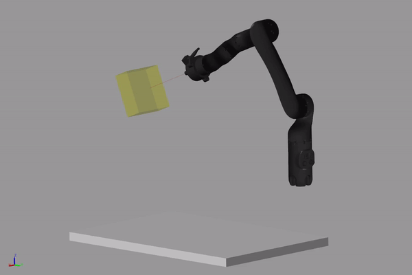
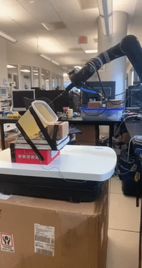

# automatedNeedleInsertionDataCollection
This repo demonstrates the Kinova Mico manipulator performing insertions into gelatin phatom tissue in order to collect data to be used for a machine learning project focused on deep tissue needle insertions. Below on the left you can see the manipulator performing the insertions in the simulation environment. On the right you can see the experimental setup. Source code and more details will be released after the completion of my degree. 

|                            Simulation                                |                            Experimental Setup                                |
|:------------------------------------------------------------------------------:|:-------------------------------------------------------------------------------:|
|| |
